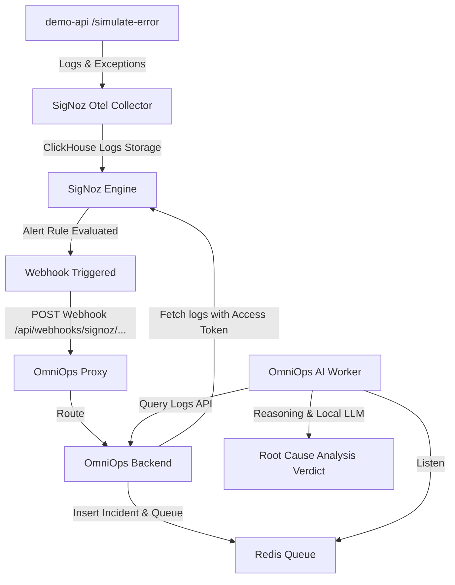

# SigNoz Triage Test Setup Guide

This guide walks you through setting up a local SigNoz instance, instrumenting the Spring Boot `demo-api` application, configuring an alert rule, and testing the end-to-end AI agent triage pipeline.

---

## Triage Flow Architecture



---

## Prerequisites

- **Docker** and **Docker Compose** installed on your machine.
- **Java 17** installed (for building and running the `demo-api`).
- **Ollama** installed on your host machine (with the `llama3` model pulled via `ollama pull llama3`).

---

## Step 1: Start SigNoz

1. Navigate to the `signoz-docker` directory in the project root:
   ```bash
   cd signoz-docker
   ```
2. Start the SigNoz services:
   ```bash
   docker compose up -d
   ```
3. Once running, open the SigNoz UI in your browser at [http://localhost:3301](http://localhost:3301). Create an admin account if prompted.

---

## Step 2: Build & Start the Demo Java API

The `demo-api` is a Spring Boot application configured with the OpenTelemetry Java Agent to automatically instrument and export logs, traces, and metrics to SigNoz.

1. Navigate to the `demo-api` directory:
   ```bash
   cd demo-api
   ```
2. Build the application jar:
   ```bash
   ./gradlew bootJar
   ```
3. Run the startup script to launch the app on port `8082` with the OTel agent attached:
   ```bash
   ./start-demo.bat
   ```
4. Verify the app is running by visiting [http://localhost:8082/hello](http://localhost:8082/hello).

---

## Step 3: Configure SigNoz Integration in OmniOps

Before triggering alerts, configure OmniOps with SigNoz API access keys.

1. Open OmniOps at [http://localhost/](http://localhost/).
2. Navigate to the **Integrations** tab.
3. Expand **SigNoz Integration**.
4. Set the fields:
   - **Host URL**: `http://host.docker.internal:8080` (this targets the SigNoz query service from within the OmniOps Docker network).
   - **Service API Token**: Generate a token from the SigNoz UI by going to **Settings &rarr; Access Tokens &rarr; Create New Token**, copy it, and paste it here.
5. Click **Test Connection** to verify, then click **Save SigNoz Configuration**.

---

## Step 4: Create Alert Rule in SigNoz

1. Open the SigNoz Dashboard ([http://localhost:3301](http://localhost:3301)) and go to the **Alerts** tab.
2. Click **New Alert Rule**.
3. Configure the rule query:
   - Select **Logs** under "Select Query Type".
   - Enter log filter criteria:
     - `serviceName = 'demo-java-api'` AND `body CONTAINS 'Simulated error'`
4. Set rule conditions:
   - Condition: `count(A) > 0`
   - Evaluation window: `1m`
5. Configure the **Notification Channel**:
   - Create a Webhook notification destination:
     - URL: `http://host.docker.internal/api/webhooks/signoz/00000000-0000-0000-0000-000000000001`
     *(This targets the default tenant seeded in the OmniOps backend)*
6. Save the rule.

---

## Step 5: Trigger the Incident & Verify Triage

1. Force an application crash by making a GET request to the error simulator endpoint:
   ```bash
   curl http://localhost:8082/simulate-error
   ```
2. SigNoz collects the log and stacktrace, triggers the alert rule, and sends a webhook to OmniOps.
3. Open the OmniOps Dashboard ([http://localhost/](http://localhost/)).
4. You will see a new incident generated under the **Triage Audit Log**.
5. The AI Agent will pick it up, query the SigNoz Log API for the incident timeframe to extract the exception message and stacktrace, execute reasoning steps, and produce a completed **Root Cause Verdict** and summary report!
